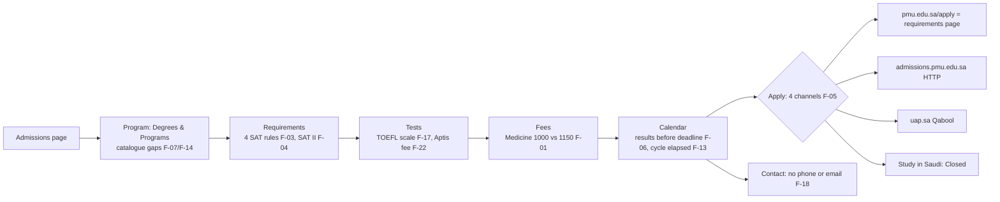

# PMU Admissions Web Content — Independent Audit

**Scope start:** https://www.pmu.edu.sa/admission/admission  
**Verification date:** 30 September 2026  
**Method:** Built from zero. No earlier audit, count or conclusion was used. Every finding comes from pages fetched on the verification date.  
**Access mode:** Read-only. No form was submitted, no account was created and no Apply control was clicked.

---

## الملخص التنفيذي (Arabic executive summary)

- **الحقيقة المُتحقَّق منها:** توجد في محتوى القبول تعارضات قائمة تمس **الأهلية والمال والمواعيد ومسار التقديم**. أبرزها:
  - رسوم تقديم الطب منشورة بقيمتين: **SAR 1000** في صفحة القبول و**SAR 1,150** في صفحة الرسوم.
  - رسوم التحويل والزائر منشورة بقيمتين: **SAR 500 (excl. VAT)** و**SAR 950 (incl. VAT)**.
  - تُنشر أربع قواعد مختلفة لقبول SAT بديلًا عن قدرات/تحصيلي.
  - صفحة الطلاب الدوليين ما زالت تشترط **SAT II**، وقد أوقفته College Board عام 2021.
  - يعلن تقويم القبول النتائج في **19–21 يوليو 2026**، أي قبل آخر موعد لتسليم IELTS/TOEFL ووثائق التحويل (**20 يوليو**).
  - توجد أربع قنوات تقديم متعارضة: `pmu.edu.sa/apply` و`admissions.pmu.edu.sa` وقبول `uap.sa` وStudy in Saudi.
  - تختلف قائمة التخصصات الخاضعة للمتطلبات الأعلى بين أربع صفحات.
- **القيود:** تعذّر عرض الصفحات في متصفح حقيقي. شهادة TLS رُفضت عبر وكيل البيئة، ولم أعطّل التحقق من الشهادات. لذلك **لا استنتاجات بصرية ولا استنتاجات وصول (a11y) قائمة على العرض**، والتدقيق نصي وبنيوي فقط. موقع ETS محجوب في البيئة، فمصدر بند مقياس TOEFL الجديد ثانوي.
- **التوصية:** المشروع **غير قابل للإغلاق حاليًا (NOT MET)**. الإغلاق مشروط بقرارات مالكي السياسات: القبول والمالية والشؤون الأكاديمية. الإصلاح التحريري وحده لا يكفي.

---

## 1. Executive summary (English)

- **Resources reviewed:** 41 URLs, 38 of them on PMU domains, plus external verification.
- **Findings raised:** 31.

| Severity | Count |
|---|---|
| High | 8 |
| Medium | 13 |
| Low | 8 |
| Enhancement | 2 |

- **Withdrawn after re-verification:** 1 (see §7).
- **Root cause:** each rule family (eligibility thresholds, SAT equivalence, fees, program scope, application channel) is re-typed on 4–6 separate pages with no canonical owner and no effective date. This is proven by cross-page diffs, not assumed.
- **Critical path:** policy decisions by the rule owners, not web editing.

---

## 2. Coverage register (condensed)

| # | Page | URL (pmu.edu.sa unless stated) | Status |
|---|---|---|---|
| C1 | Admissions Office (start) | /admission/admission | Reviewed |
| C2 | Undergraduate Admissions | /Admission/Undergraduate_Programs_Admission.aspx | Reviewed |
| C3 | Direct Admissions from Secondary School | /Admission/Direct-Admissions-from-Secondary-School.aspx | Reviewed |
| C4 | Admission to the Preparatory Program | /Admission/Admission-to-the-Preparatory-Program.aspx | Reviewed |
| C5 | CS & Engineering Majors Requirements | /Admission/Admissions_Requirements_CS_Eng_Majors.aspx | Reviewed |
| C6 | College of Medicine Admission | /admission/college_of_medicine_admission | Reviewed |
| C7 | Transfer Admissions | /Admission/Admission-from-Other-Universities.aspx | Reviewed |
| C8 | Visiting Student Admission | /Admission/Visiting-Student-Admission.aspx | Reviewed |
| C9 | Prep → UG | /Admission/Admission-from-the-Prep-to-UG-Programs.aspx | Reviewed |
| C10 | Placement Tests Overview | /Admission/Overview-Undergraduate-Placement-Tests.aspx | Reviewed |
| C11 | Aptis | /Admission/Aptis-Placement-Test.aspx | Reviewed |
| C12 | IELTS | /Admission/IELTS-Admission.aspx | Reviewed |
| C13 | TOEFL | /Admission/TOEFL-Admission.aspx | Reviewed |
| C14 | SAT | /Admission/SAT-Admission.aspx | Reviewed |
| C15 | Admissions Calendar (Fall 2026-27) | /Admission/Admission_Calendar_FS_RO.aspx | Reviewed |
| C16 | Academic Calendar 2021/2022 (legacy) | /Admission/academic_calendar_2021_2022_ro.aspx | Reviewed |
| C17 | Apply | /apply (and /apply.aspx) | Reviewed |
| C18 | Legacy application system | http://admissions.pmu.edu.sa/ | Reviewed (title only renders) |
| C19 | International Students | /Admission/International_Students.aspx | Reviewed |
| C20 | MBA_International_Students (legacy-pattern) | /admission/MBA_International_Students.aspx | Reviewed |
| C21 | Future Students | /Admission/Future_Students_RO.aspx | Reviewed |
| C22 | Degrees & Programs | /Admission/Degrees_Programs_FS_RO.aspx | Reviewed |
| C23 | Admission Query form | /Admission/admissions_queries | Reviewed (not submitted) |
| C24 | Contact (Future Students) | /Staff_Profile/Staff_List.aspx?…DEpt=4 → 302 → http://faculty.pmu.edu.sa/PMUStaffs/DepartmentStaffList/4 | Reviewed |
| C25 | Graduate Admissions home | /Admission/Admission_Graduate_Degree_Programs.aspx | Reviewed |
| C26 | Graduate Contact | /Admission/Admission_Contact_GDP.aspx | Reviewed |
| C27–C33 | Grad requirements: PhD ME, PhD BA, EMBA, MBA, MSHD, MSME, EMGMS, MIBL | …_GDP.aspx pages | Reviewed |
| C34 | Tuition & Fees hub | /admission/tuition_fees_ro.aspx | Reviewed |
| C35 | UG Fees hub | /Admission/Fees_TF_RO.aspx | Reviewed |
| C36 | UG Fees 2026/27, 2025/26, 2024/25 | /Admission/fees_tf_ro_20xx_20xx.aspx | Reviewed |
| C37 | Medical Program Fees | /Admission/medical_program_studies_fees_tf_ro.aspx | Reviewed |
| C38 | Post Graduate Fees | /Admission/Post_Graduate_Fees_TF_RO.aspx | Reviewed |
| C39 | Other Fees / FAQ / Payment Schedule hub | Student_Fees_TF_RO / FAQ_TF_RO / payment_schedule_tf_ro | Reviewed |
| C40 | IELTS Testing Centre | http://csbd.pmu.edu.sa/Continuing-Education/IELTS-Testing-Centre.aspx | Reviewed |
| C41 | Arabic path probe | /ar/admission/admission | HTTP 404 |

**Identified but not reviewed** (coverage gap, no conclusions drawn):

- Application_Form_* pages for all graduate programs.
- MSEE, MSCE and MSID requirement pages.
- Preparatory Program Study Plan.
- Summer Tuition and Payment Method pages.
- Semester-specific payment schedules.
- Financial Aid sub-pages.
- Registration Office.
- `Catalog_Admission_Requirements_and_Procedures.pdf`. It is publicly hosted, but its text could not be extracted in this environment. The fetch tool reported file metadata dated 2013, which is unverified.

---

## 3. Findings register

Severity reflects the applicant or operational impact. Confidence scale:

- **Verified:** the exact text was observed on the verification date.
- **Strong indication:** observed, but the tooling or context leaves some doubt.
- **Needs owner confirmation:** the fact is observed, but only the rule owner can decide what is correct.

### HIGH

**F-01. College of Medicine application fee published at two values**
- **Pages:**
  - College of Medicine Admission — https://www.pmu.edu.sa/admission/college_of_medicine_admission
  - Medical Program Studies Fees — https://www.pmu.edu.sa/Admission/medical_program_studies_fees_tf_ro.aspx
- **Type:** Data conflict (money)
- **Observed:** The admission page and the fee page state different application fees for the same applicant type and cycle.
- **Evidence:**
  - Admission page: *"Pay a non-refundable application fee of SAR 1000 (incl. VAT) upon submission of documents"*
  - Fee page: *"Medical Application Fee — SAR 1,150 (VAT inclusive)"*, applicable to *"students admitted/readmitted from Fall Semester 2026/2027"*
  - General fee table (Student_Fees_TF_RO) lists only the SAR 950 UG and Grad fees and has no Medicine line.
- **Why it matters:** The applicant pays or budgets the wrong amount. The mismatch also creates collection and reconciliation disputes.
- **Treatment:** Finance confirms the single value. Publish it once in the fee table and reference it from the Medicine page.
- **Owner:** Finance (fee owner) and Admissions (page owner)
- **Confidence:** Verified conflict. Needs owner confirmation of which value is correct.

**F-02. Transfer/Visiting application fee conflicts between pages**
- **Pages:**
  - International Students — /Admission/International_Students.aspx
  - Transfer — /Admission/Admission-from-Other-Universities.aspx
  - Visiting — /Admission/Visiting-Student-Admission.aspx
- **Type:** Data conflict (money, VAT basis)
- **Evidence:**
  - International page: *"Transfer/Visitor application: SAR 500 (excl. VAT)"*
  - Transfer and Visiting pages: *"non-refundable application fee: SAR 950 (incl. VAT)"*
  - The Transfer page's own document list includes *"Saudi ID or Iqama"*, so it also addresses non-Saudi applicants.
- **Why it matters:** Two amounts on two VAT bases for the same fee.
- **Treatment:** Finance decides whether a separate non-Saudi transfer fee exists. If it does, add it to the fee table with its category label. If not, remove it.
- **Owner:** Finance and Admissions
- **Confidence:** Verified conflict. Needs owner confirmation.

**F-03. Four different rules for using SAT in place of Qudrat/Tahseely**
- **Pages:** /apply, /Admission/SAT-Admission.aspx, /admission/college_of_medicine_admission, /Admission/International_Students.aspx
- **Type:** Rule conflict (eligibility) / SSOT
- **Evidence:**
  - /apply: *"Alternatively, a SAT 1 total score of 1200 is accepted in place of both Qudrat and Tahseely."* No applicant-type restriction.
  - SAT page: *"Students with international high school certificate might submit SAT with minimum score of 1200 instead of Qudrat and Tahseely tests."* Restricted to holders of international certificates.
  - Medicine: *"'SAAT – Tahseely' score (80 minimum) or SAT 1 (1300)"*
  - International page: weights *"Secondary School 40%, SAT I 30%, SAT II 30%"* and *"Acceptable SAT I"*, with no score given.
- **Why it matters:** Whether a Saudi-certificate holder may substitute SAT is answered differently depending on the page read. Medicine using 1300 may be a legitimate category-specific value. The /apply versus SAT-page restriction is a real contradiction.
- **Treatment:** Admissions issues one SAT equivalence rule per applicant category, with effective cycle, and publishes it on one canonical page.
- **Owner:** Admissions (policy), Academic Affairs (equivalence approval)
- **Confidence:** Verified conflict. Needs owner confirmation.

**F-04. Discontinued test (SAT II) required for international Engineering/CS applicants**
- **Page:** International Students — https://www.pmu.edu.sa/Admission/International_Students.aspx
- **Type:** Obsolete requirement
- **Evidence:**
  - PMU page: *"Engineering/CS: Secondary School 40%, SAT I 30%, SAT II 30%"*
  - External source: College Board ended SAT Subject Tests in the US in January 2021. The last international administrations were in May and June 2021 ([Peterson's](https://www.petersons.com/blog/college-board-eliminates-sat-subject-tests-and-the-sat-optional-essay/), [StudyInternational](https://studyinternational.com/news/college-board-scraps)).
- **Why it matters:** No applicant can satisfy this weighting today. It also contradicts F-03.
- **Treatment:** Replace it with the current rule once F-03 is decided. Also retire the "SAT I" wording (see F-24).
- **Owner:** Admissions
- **Confidence:** Verified. The external fact was confirmed through secondary sources; the College Board site itself was not fetched.

**F-05. Four application channels published for the same cycle; the "Apply" page is not an application system**
- **Pages:**
  - Calendar: /Admission/Admission_Calendar_FS_RO.aspx
  - /apply
  - Transfer page
  - International page
  - http://admissions.pmu.edu.sa/
  - Medicine page
- **Type:** Routing / journey
- **Evidence:**
  - Calendar: *"For Saudi Students: Apply online through Qabool platform: https://www.uap.sa/"* and *"For non Saudi Students: Apply online through Study in Saudi platform … Closed"*
  - Medicine: *"Complete online application at https://www.uap.sa/"*
  - Transfer: *"Complete online application at http://admissions.pmu.edu.sa/"* (plain HTTP; the page renders only the title "PMU Student Application").
  - International page and Prep page: *"https://pmu.edu.sa/apply"*
  - /apply itself is a requirements summary. Its "Apply to PMU" button points to `../apply.aspx`. No link to Qabool, Study in Saudi or any live form was found.
- **Why it matters:** An applicant cannot tell where to apply. A non-Saudi applicant is told both "Closed" (calendar) and "apply at pmu.edu.sa/apply" (International page). Applications may be lost or duplicated.
- **Treatment:** Admissions defines one channel per applicant type and cycle: Saudi freshman, non-Saudi, transfer, visiting, Medicine and graduate. Make /apply a router to those channels. Retire or redirect the HTTP legacy portal.
- **Owner:** Admissions; IT/Web for redirects
- **Confidence:**
  - Verified: the channel texts.
  - Strong indication: that the `apply.aspx` button loops back. It was a static fetch, and client-side behaviour was not rendered.

**F-06. Admission results announced before the document deadlines close**
- **Page:** Admissions Calendar — https://www.pmu.edu.sa/Admission/Admission_Calendar_FS_RO.aspx
- **Type:** Internal date inconsistency
- **Evidence:**
  - *"Last day to submit IELTS or TOEFL iBT — 2026-07-20"*
  - *"Last day for Transfer applicants to submit documents in person — 2026-07-20"*
  - *"Announcement of admission results through Qabool platform — July 19-21, 2026"*
  - The date formats are also mixed: ISO in some rows, "July 19-21, 2026" in another.
- **Why it matters:** Results can be published while evidence is still being accepted. This invites disputes and appeals.
- **Treatment:** Admissions confirms the true sequence (results may be only for applicants who are already complete) and labels it explicitly.
- **Owner:** Admissions
- **Confidence:** Verified. The intended logic needs owner confirmation.

**F-07. Majors covered by the higher STEM thresholds differ across four pages**
- **Pages:** /Admission/Admissions_Requirements_CS_Eng_Majors.aspx, /Admission/SAT-Admission.aspx, /apply, /Admission/Degrees_Programs_FS_RO.aspx
- **Type:** Scope conflict (eligibility)
- **Evidence:**
  - CS/Eng page lists: *"Architecture, Computer Science, Computer Engineering, Software Engineering, Mechanical Engineering, Electrical Engineering and Civil Engineering."* (7 majors)
  - SAT page adds *"artificial intelligence"* (8 majors).
  - /apply heading: *"AI, Computer Science, Architecture & Engineering Majors"*
  - Degrees page also offers these, which appear on none of the lists: B.S. Chemical Engineering, Cybersecurity, Information Technology, Graphic Design and Interior Design.
- **Why it matters:** Applicants to AI, Cybersecurity or Chemical Engineering cannot tell whether 85/65/65 or 80/60 applies.
- **Treatment:** Academic Affairs and Admissions publish one authoritative major-to-requirement mapping covering every offered major.
- **Owner:** Academic Affairs, Admissions
- **Confidence:** Verified scope difference. Needs owner confirmation of the intended list.

**F-08. Graduate "Academic Calendar" link leads to the 2021/2022 calendar**
- **Pages:** Graduate Admissions — /Admission/Admission_Graduate_Degree_Programs.aspx. The admission-page footer "Calendar" link has the same target.
- **Type:** Obsolete destination
- **Evidence:** The link goes to `/Admission/academic_calendar_2021_2022_ro.aspx`. That page's heading is *"ACADEMIC CALENDAR 2021 / 2022"* and it contains *"August 29, 2021 – Classes begin"*.
- **Why it matters:** Graduate applicants and students see dates from five years ago with no warning.
- **Treatment:** Repoint the link to the current calendar. Mark the 2021/22 page as archived or redirect it (see §6).
- **Owner:** Registrar/Registration Office; Web team
- **Confidence:** Verified

### MEDIUM

**F-09. Medicine: published component minimums cannot reach the published threshold; the interview-stage threshold is undefined**
- **Page:** /admission/college_of_medicine_admission
- **Type:** Arithmetic / ambiguity
- **Evidence:**
  - *"20% high school + 40% Qudrat + 40% Tahseely were 86 is the minimum acceptable score"*
  - Document minimums: secondary *"(95%)"*, Qudrat *"(80 minimum)"*, Tahseely *"(80 minimum)"*
  - At the minimums: 0.2×95 + 0.4×80 + 0.4×80 = **83 < 86**.
  - A separate composite is given (*"Total weighted score 60% / Interview 40%"*), with no pass mark.
- **Why it matters:** An applicant who meets every stated minimum is still ineligible, and the final ranking rule is not disclosed. This is **not** a contradiction: a composite floor above the component floors is legitimate. It is an unexplained sequence.
- **Treatment:** State plainly that both the component minimums and the 86 composite must be met. Define whether a final composite threshold exists.
- **Owner:** College of Medicine, Admissions
- **Confidence:** Verified arithmetic. Policy intent needs owner confirmation.

**F-10. Medicine page body contains generic/draft-quality wording in the eligibility section**
- **Page:** Same as F-09
- **Type:** Editorial / credibility
- **Evidence:**
  - *"…the process typically involves understanding the weighting and criteria that the medical college uses to evaluate applicants."*
  - *"were 86"* (should be "where")
  - *"College of Medical major"*
- **Why it matters:** Non-committal language in a binding eligibility section weakens trust and makes the rule harder to rely on.
- **Treatment:** Rewrite the section as a rule statement.
- **Owner:** College of Medicine content owner, Admissions
- **Confidence:** Verified

**F-11. Medicine Seat Reservation Fee missing from the decision page**
- **Page:** Medicine admission page. The fee appears only on the Medical fees page.
- **Type:** Silent-page gap (money)
- **Evidence:**
  - Fees page: *"Medical Seat Reservation Fee — SAR 20,000"*, *"Non-refundable."*
  - The admission page mentions only the application fee.
- **Why it matters:** A non-refundable SAR 20,000 obligation is invisible at the point where the applicant decides.
- **Treatment:** Cross-reference every mandatory fee on the admission page, linking to the canonical fee entry.
- **Owner:** Admissions, Finance
- **Confidence:** Verified

**F-12. "Minimum weighted total" for below-threshold applicants is referenced but never published**
- **Pages:** CS/Eng page, Direct Admissions, Undergraduate Admissions, Prep page
- **Type:** Completeness
- **Evidence:**
  - CS/Eng: *"Students with lower marks may apply, however, the minimum weighted total, defined by the Admissions Office, should be met."*
  - Other pages: *"acceptance will depend on the overall results of the following criteria: Secondary School 60%, General Aptitude Test 40%"*, with no threshold.
- **Why it matters:** The lower-score pathway cannot be self-assessed.
- **Treatment:** Publish the threshold per cycle, or state explicitly that it varies by cycle and capacity.
- **Owner:** Admissions
- **Confidence:** Verified absence

**F-13. Only one admissions cycle is published, and it has fully elapsed**
- **Page:** Admissions Calendar
- **Type:** Currentness
- **Evidence:**
  - Every undergraduate and graduate date falls between 2026-05-03 and 2026-08-30.
  - *"Orientation for new applicants — TBA"* is still shown after classes began on 30 Aug 2026.
  - No Spring 2027 or Fall 2027 window is shown, and there is no "next cycle opens" notice.
- **Why it matters:** At 30 Sep 2026, an applicant cannot tell whether a Spring intake exists.
- **Treatment:** Add the next cycle, or an explicit "applications for Spring 2027 are not offered / open on …" message. Remove "TBA".
- **Owner:** Admissions
- **Confidence:** Verified. Spring intake existence needs owner confirmation.

**F-14. Graduate program catalogue and naming inconsistent across nav, home, degrees and fees pages**
- **Pages:** Admission nav (C1), Graduate home (C25), Degrees & Programs (C22), Post Graduate Fees (C38)
- **Type:** Catalogue / SSOT
- **Evidence:**
  - Nav lists 11 programs, including *EMGMS*.
  - The Graduate home and the Degrees page each list 10 programs, without Engineering Management.
  - The fees page lists 13 programs, adding *"Master of Engineering in Innovation, Sustainability, and Entrepreneurship"* and *"PRE-Master for Master of Education"*, neither of which appears elsewhere.
  - The same program is called *"Master of Science in Human Development"*, *"Master of Human Development"* and *"Master of Science in Education and Human Development"*. Its URL slug is `MSEHD`.
- **Why it matters:** It is unclear which programs are open for admission.
- **Treatment:** Academic Affairs issues the official active-program list with approved names. All pages derive from it.
- **Owner:** Academic Affairs / Graduate Studies
- **Confidence:** Verified difference. Availability needs owner confirmation.

**F-15. EMGMS requirements appear copied from another institution and cite a retired test format**
- **Page:** /Admission/Admissions_Requirements_emgms_GDP.aspx
- **Type:** Obsolete / provenance
- **Evidence:**
  - *"TOEFL – minimum of 79 iBT (or 60 on the revised PBT with no section score lower than 15)"*
  - *"Graduate English Language Endorsement from UA Center for English as Second Language (CESL)"*
  - *"IELTS – minimum composite score of 7, with no subject area below a 6"*
- **Why it matters:**
  - The TOEFL paper-based formats are retired. The TOEFL iBT Paper Edition ended 20 Jan 2024 (ETS paper-edition page, via search result; ets.org is blocked in this environment).
  - "UA CESL" refers to an external university's centre, which suggests the text came from a partner institution.
  - IELTS 7 paired with TOEFL 79 breaks the equivalence PMU uses everywhere else (IELTS 6.0 ↔ TOEFL 83).
- **Treatment:** Graduate Studies confirms whether EMGMS is a joint program and what requirements PMU applies. Remove the retired formats.
- **Owner:** Graduate Studies, College of Engineering
- **Confidence:** Strong indication. Needs owner confirmation.

**F-16. MIBL: English equivalence and study-load arithmetic inconsistent**
- **Page:** /Admission/Admissions_Requirements_MIlBL_GDP.aspx. Credit count is taken from the Post Graduate Fees page.
- **Type:** Internal consistency
- **Evidence:**
  - *"IELTS … 6.5 overall and 5.5 in each skill"* is paired with *"equivalent TOEFL iBT … 83 overall"*. Other PMU pages equate 83 to IELTS 6.0.
  - The page states the program *"typically takes two years in full-time mode, with a maximum of 6 credits per semester"*.
  - The fees page lists *"International Business Law (36)"* credits.
  - 36 ÷ 6 = 6 semesters, which is not two years unless summer terms are counted.
- **Why it matters:** Applicants may present the wrong score and plan the wrong duration.
- **Treatment:** The College of Law confirms the score pair and the load and duration.
- **Owner:** College of Law, Graduate Studies
- **Confidence:** Verified text. Needs owner confirmation.

**F-17. TOEFL thresholds published only on the retired 0–120 scale**
- **Pages:** TOEFL page and all TOEFL references on UG and graduate pages
- **Type:** Currentness (external change)
- **Evidence:**
  - PMU publishes: *"Core — 83 / 19"*, *"Advanced — 63 / 15"*, and so on (0–120 scale).
  - External change: from 21 Jan 2026, ETS reports TOEFL iBT on a 1–6 band scale. It gives comparable 0–120 scores only during a transition to about Jan 2028 ([ETS score page, per search listing](https://www.ets.org/toefl/ibt/scores/understand); [govdelivery notice](https://content.govdelivery.com/landing_pages/55287/96c3e47826307f004aab2c5386fd8553)).
- **Why it matters:** Applicants holding new-scale reports cannot self-check eligibility. The problem becomes blocking once the transition ends.
- **Treatment:** Add the 1–6 band equivalents, approved by the English/Prep owner, with an effective date.
- **Owner:** Preparatory Program / English Language unit, Admissions
- **Confidence:** Strong indication. The primary ETS page is blocked in this environment.

**F-18. Contact routes lead to non-actionable destinations**
- **Pages:** Future Students "Contact" → /Staff_Profile/Staff_List.aspx?…DEpt=4; Admission Query form (C23)
- **Type:** Journey / support
- **Evidence:**
  - The Contact link returns 302 to plain-HTTP `faculty.pmu.edu.sa/PMUStaffs/DepartmentStaffList/4`.
  - That list shows 14 staff entries with **no emails or phone numbers** and one duplicated entry.
  - The Query form lists no phone, email or service hours.
  - No undergraduate admissions email or phone number was found on any reviewed admission page. Graduate Contact gives only *"graduateadmin@pmu.edu.sa"*.
- **Why it matters:** Applicants with deadline-sensitive questions have no direct channel.
- **Treatment:** Publish a role-based admissions contact block (email, phone, hours) on every admission page. Fix the duplicate entry.
- **Owner:** Admissions, HR/Web for the staff directory
- **Confidence:** Verified for the pages reviewed.

**F-19. No Arabic admissions path discovered**
- **Pages:** Start page (no language switch observed), home page, and /ar/admission/admission (HTTP 404)
- **Type:** Bilingual parity
- **Evidence:**
  - No language toggle was found in the start page or home page content.
  - The Arabic path probe returned 404.
  - Only the Admission Query form carries Arabic labels.
- **Why it matters:** The primary applicant population cannot read binding rules in Arabic, and no Arabic/English parity exists to check.
- **Treatment:** Confirm whether an Arabic admissions site exists elsewhere (for example on a separate domain). If not, scope Arabic parity for rules, thresholds, fees and CTAs.
- **Owner:** Admissions, Web/Communications
- **Confidence:** Strong indication. A rendered-browser check is needed to rule out a JavaScript language toggle.

**F-20. Legacy pages still publicly reachable and linked**
- **Pages:**
  - /admission/MBA_International_Students.aspx (reported as linked from the International Students' Office nav)
  - /Admission/academic_calendar_2021_2022_ro.aspx
  - /attachments/life_pmu/pdf/Catalog_Admission_Requirements_and_Procedures.pdf (fetch tool reported 2013 metadata)
  - http://admissions.pmu.edu.sa/
- **Type:** Legacy / duplicate
- **Evidence:** The MBA_International page repeats MBA requirements, including *"SAR 950 (incl. VAT)"* and *"pmu.edu.sa/apply"*, under an international-student URL. The calendar page says *"ACADEMIC CALENDAR 2021 / 2022"*.
- **Why it matters:** Search engines and bookmarks surface competing rule sets.
- **Treatment:** Run the lifecycle in §6.
- **Owner:** Web team, Admissions
- **Confidence:**
  - Verified for the calendar and portal.
  - Strong indication for the MBA page's nav placement and the PDF date.

**F-21. PhD pages have no program-specific apply route**
- **Pages:**
  - PhD in Mechanical Engineering — /Admission/application_form_deme_gdp.aspx (the URL says "application_form" but the page contains requirements only)
  - PhD in Business Administration — /Admission/Admissions_Requirements_phdba_gdp.aspx
- **Type:** Journey
- **Evidence:** The re-fetch found only sidebar links: *"Apply for EMBA / MBA / MSHD / MSME"*. No PhD apply link was found.
- **Why it matters:** PhD applicants reach a dead end.
- **Treatment:** Add the PhD application route, or state explicitly how to apply.
- **Owner:** Graduate Studies
- **Confidence:** Strong indication (static fetch only).

### LOW

**F-22. Aptis fee not disclosed on admission or test pages.** The fee table shows *"APTIS Exam Fees — SAR 575"*. The Aptis, Prep and Transfer pages, which schedule the test, do not mention it. Owner: Admissions/Finance. Confidence: Verified.

**F-23. Undergraduate 2026/27 fee page college scope**
- **Evidence:**
  - The page lists only *"Preparation Program"*, *"Architecture, Computer Engineering, Engineering Colleges"* and *"Business Administration, Law Colleges"*.
  - It does not say where Graphic/Interior Design, IT, AI or Cybersecurity fall.
  - The 2025/26 page separated *"Artificial Intelligence & Cybersecurity Majors"*.
  - "Computer Engineering" is not the college's name ("Computer Engineering and Science").
- **Owner:** Finance
- **Confidence:** Needs owner confirmation.

**F-24. Legacy test name "SAT 1 / SAT I".** It appears on C2, C3, C5, C6, C7, C8, C17 and C19. College Board no longer uses "SAT I". Use "SAT". Owner: Admissions. Confidence: Verified.

**F-25. Minor fee-rate rounding and possible typo**
- 2025/26 overload rate *"SAR 2,416"* versus part-time rate *"SAR 2,416.7"* on the same page.
- Continuing graduate rates: EMBA alumni *"1,334"* versus MBA alumni *"1,354"*, while non-alumni rates are identical.
- Owner: Finance. Confidence: Needs owner confirmation.

**F-26. Copy defects**
- *"Wave"* for "waive" (CS/Eng page and SAT table)
- *"ADMISSSIONS"* in the PhD ME H1
- Date formats mixed within the calendar
- Footer *"2021 © PMU"* on admission pages and *"2020 ©"* on the home page
- Arabic form labels *"الأسم"*, *"الإستفسار"* and *"البريد الإللكتروني"*. Transcribed via a text tool, so this is a Strong indication.
- Owner: Web/Content QA

**F-27. Terminology drift for the target level**
- The Aptis page says *"direct Core Program entry"*.
- The IELTS and TOEFL tables use the level *"Core"*.
- The Admissions pages say *"direct entry to the undergraduate program"*.
- Owner: Prep Program. Confidence: Verified.

**F-28. Non-HTTPS destinations in the admissions journey.** These are the legacy portal (F-05), the IELTS Testing Centre and the staff directory redirect. Owner: IT/Web. Confidence: Verified from the link targets.

**F-29. IELTS Testing Centre link lands on an empty stub.** The page is http://csbd.pmu.edu.sa/…/IELTS-Testing-Centre.aspx. Its main content is empty: there are no dates, no fee and no booking route. Owner: Continuing Education. Confidence: Strong indication.

### ENHANCEMENT

**F-30. New-student refund terms not published before application.** The FAQ says: *"New students may be eligible for a partial refund … as per the terms and conditions of the acceptance letter."* Publish the refund schedule on the fees page. Owner: Finance.

**F-31. No effective date or owner stamp on any rule page.** No "last reviewed" or "effective from" line was seen on requirement pages. This enables drift (see F-03, F-07 and F-14). Owner: Admissions governance.

---

## 4. Likely false positives — do NOT escalate

| Observation | Why it is legitimate |
|---|---|
| Medicine thresholds (95/80/80, 86 composite) are higher than general ones (80/60) | Category-specific rule. Only the clarity issue F-09 stands. |
| CS/Eng 85/65/65 with 40/30/30 weights vs general 80/60 with 60/40 | Explicitly scoped per major group. Only the scope list conflict (F-07) stands. |
| Graduate English is "5.5 in each skill"; UG is "5.5 in writing" | Different programs and different standards, stated consistently within each level. |
| UG "Day students may register up to 20 credits" vs fee band "12 to 18" plus per-credit overload | Complementary. Credits 19–20 are billed as overload. |
| 2024/25 page "12 and above" vs 2026/27 "12 to 18" | Different cohorts (continuing vs new). The labels explain it. |
| Graduate application fee equals UG (SAR 950) | Consistent on the fee table and MBA pages. |
| Graduate total fees vs per-credit rates | Recomputed for all 12 programs (e.g. 65,000 ÷ 1,805.55 ≈ 36; 150,000 ÷ 2,083.3 ≈ 72). **All reconcile.** Measured pass. |
| IELTS 6.0/5.5 ↔ TOEFL 83/19 for Core | Consistent across UG, IELTS, TOEFL and most graduate pages. Measured pass. The exceptions are F-15 and F-16. |
| TOEFL "online or home edition is not accepted" | A legitimate institutional choice, not an error. |
| Transfer GPA 2.0/4.0 and 5-year course recency | Stated once, with no conflicting value found. |

---

## 5. Applicant journey — observed state

---

## 6. Legacy treatment (per case, not blanket deletion)

| Asset | Proposed lifecycle |
|---|---|
| academic_calendar_2021_2022_ro.aspx | Replace links with the current calendar → add an "Archived" banner or 301 → verify no inbound nav links remain → archive |
| MBA_International_Students.aspx | Confirm the intended content with Graduate Studies → merge into the MBA and International pages → 301 → retire |
| admissions.pmu.edu.sa (HTTP) | Confirm with IT whether the system is live → if not, redirect to the canonical Apply router → retire |
| Catalog_Admission_Requirements_and_Procedures.pdf | Confirm the version → replace with the current catalog or noindex it with a "superseded" note → archive |

---

## 7. Self-correction (withdrawn / downgraded)

- **Withdrawn: "PhD ME Apply button points to the MSHD application form."** The first automated extraction suggested this. A targeted re-fetch showed that "Apply for MSHD" is one of several sidebar links, not the page's CTA. It is replaced by F-21 (no PhD-specific apply route), rated Strong indication.
- **Downgraded: Medicine 86 threshold versus component minimums.** First read as a contradiction. A composite floor above component floors is legitimate, so it is retained only as a clarity issue (F-09).
- **Not raised: 20-credit day load versus the 18-credit fee band.** Checked and judged complementary (§4).

---

## A) Top findings for the management pack

| Rank | ID | One-line |
|---|---|---|
| 1 | F-05 | Four conflicting application channels; "Apply" is not an application system |
| 2 | F-03 + F-04 | SAT equivalence published four ways, including a test discontinued in 2021 |
| 3 | F-01 + F-02 | Application fee conflicts (Medicine 1000 vs 1150; Transfer 500 excl. VAT vs 950 incl. VAT) |
| 4 | F-07 + F-14 | Program scope and catalogue not single-sourced; eligibility tier unclear for AI, Cyber and ChemE |
| 5 | F-06 + F-13 | Calendar sequence defect; no current or next cycle shown at 30 Sep 2026 |
| 6 | F-08 + F-20 | Legacy 2021/22 calendar and legacy pages still linked |
| 7 | F-18 | No actionable admissions contact (phone or email) |
| 8 | F-17 | TOEFL thresholds not updated for the 2026 ETS scale change |
| 9 | F-19 | No Arabic admissions path found |
| 10 | F-31 | No effective-date or owner governance (the root cause) |

## B) Supporting appendix only

F-09 to F-12, F-15, F-16, F-21 to F-30, and the whole §4 false-positive list. Also the measured passes: graduate fee arithmetic, IELTS↔TOEFL Core equivalence, and consistency of the transfer rules.

## C) Visual/accessibility items NOT verified

The rendered-browser probe failed with `ERR_CERT_AUTHORITY_INVALID` through the environment's TLS proxy. TLS verification was deliberately not disabled. The following remain **unverified**, and no conclusion is drawn about any of them:

- Layout, visual hierarchy, CTA prominence and density.
- Mobile (375 px) horizontal overflow and table overflow. The IELTS, TOEFL, SAT, Calendar and fee tables are the highest risk.
- `<html lang>` and `dir` values, heading order in the DOM, image `alt` coverage, focus order, keyboard operability and contrast.
- Form semantics on the Admission Query form: label–input association, error-state messaging, and CAPTCHA accessibility (only an image CAPTCHA was observed; no audio alternative was seen).
- Any JavaScript language toggle or client-side redirect on /apply.
- **No WCAG compliance or non-compliance claim is made.**

## D) Closure recommendation

**Current verdict: FULL PROJECT CLOSURE — NOT MET** (this is the measured baseline at 30 Sep 2026).

The project can close only when **all** of the following gates are proven on the live site:

1. **Policy decisions recorded** by the owning functions for:
   - Medicine and transfer fees (Finance)
   - SAT equivalence per applicant category (Admissions and Academic Affairs)
   - The STEM major list (Academic Affairs)
   - The active graduate catalogue and names (Graduate Studies)
   - The TOEFL 1–6 equivalents (English/Prep unit)
   - The application channel per applicant type (Admissions)
2. **Single source:** each rule family appears in one canonical place. Every other page references it, and a cross-page diff returns zero value conflicts (baseline: 7 conflict families).
3. **No obsolete requirements:** SAT II, revised PBT and "SAT I" occur 0 times; the baseline is at least 10 occurrences.
4. **Journey:** each applicant type reaches exactly one live channel from /apply. No HTTP-only or legacy destination remains in the admissions nav.
5. **Currentness:** the calendar shows the current or next cycle with an internally consistent sequence. No linked calendar predates the current year.
6. **Contact:** a role-based email, phone and hours block appears on every admission page.
7. **Governance:** every rule page shows an owner role and an effective or last-reviewed date.
8. **Arabic parity:** either an Arabic path with verified parity of rules, fees and CTAs, or a documented decision by management.
9. **Rendered verification:** a real-browser pass (mobile and desktop) and an accessibility check are completed and recorded. Gate C must no longer be "unverified".

Publishing edits alone does not meet a gate. Each gate needs re-verification evidence (URL, verbatim text, date).

---

### External sources used
- College Board SAT Subject Test discontinuation: [Peterson's](https://www.petersons.com/blog/college-board-eliminates-sat-subject-tests-and-the-sat-optional-essay/), [StudyInternational](https://studyinternational.com/news/college-board-scraps), [Elite Prep](https://eliteprep.com/blog/2021/1/20/college-board-ends-sat-subject-tests-and-sat-essay)
- TOEFL iBT Paper Edition end (20 Jan 2024): [ETS paper edition page](https://www.ets.org/toefl/test-takers/ibt/about/content/paper.html). Seen via search; direct fetch was blocked.
- TOEFL 1–6 score scale from 21 Jan 2026: [ETS scores page](https://www.ets.org/toefl/ibt/scores/understand) (search listing), [govdelivery notice](https://content.govdelivery.com/landing_pages/55287/96c3e47826307f004aab2c5386fd8553), [Cialfo](https://www.cialfo.co/blog/?p=1421)
